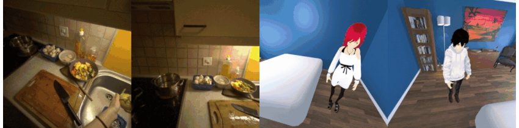

<div align="center">

<h1>ME-World: Multi-Agent Egocentric World Model with <br>Fine-Grained Embodied Interaction</h1>

[**Dahyun Chung**](https://dhyun22.github.io/),&nbsp;&nbsp;
[**Siyoon Jin**](https://jinsy515.github.io/my-page/),&nbsp;&nbsp;
[**Hyunwook Choi**](https://eenrue.github.io/),&nbsp;&nbsp;
[**Honggyu An**](https://hg010303.github.io/),&nbsp;&nbsp;
[**Junyoung Seo**](https://j0seo.github.io/),&nbsp;&nbsp;
<br>
[**Hyunsung Kim**](https://scholar.google.com/citations?hl=ko&user=8wSdx3UAAAAJ),&nbsp;&nbsp;
[**Seung Wook Kim**](https://glow-lab-kaist.github.io/people.html)<sup>&dagger;</sup>,&nbsp;&nbsp;
[**Seungryong Kim**](https://cvlab.kaist.ac.kr)<sup>&dagger;</sup>

  <p align="center">
     KAIST&nbsp;AI
  </p>

  <p align="center" style="font-size: 0.9em; color: gray;">
    <sup>&dagger;</sup> Co-corresponding&nbsp;authors.
  </p>


<a href="https://cvlab-kaist.github.io/ME-World/"></a>




</div>

# ToDo
- [x] Project page: [cvlab-kaist.github.io/ME-World](https://cvlab-kaist.github.io/ME-World/)
- [ ] arXiv preprint
- [ ] Inference code and model weights
- [ ] Training code
- [ ] Synthetic multi-agent data generation pipeline
- [ ] Evaluation code for the shared-world consistency metrics

# 🚀 Overview

Egocentric world models predict first-person observations from an agent's actions, but most of them simulate a single agent. Real embodied settings involve several agents acting and interacting in one shared environment, where every interaction has to be visible from every agent's viewpoint and the resulting state changes have to appear in all observations at once.

**ME-World** formulates embodied multi-agent world modeling as synchronized ego-stream generation: it generates one first-person video per agent for agents interacting through fine-grained body and hand motion in a shared world. Three components keep the streams coupled:

- **Joint multi-agent generation** — all ego streams are denoised together in a single token sequence, so cross-stream information is exchanged at every layer.
- **Shared action conditioning** — every agent's body motion is projected into each agent's own camera: the wearer's own hands and arms, and the other agents' bodies, with a fixed palette per identity. Head motion enters as per-pixel rays in a shared canonical frame.
- **Shared environment memory** — all agents' observation history is pooled; the best-covering history frame is warped into each target view (stream-aligned geometric memory), and a greedily selected set of clean anchor frames is appended to the sequence for every stream to attend to (cross-stream anchor memory).

The model is trained on real two-person recordings and on a synthetic set rendered from retargeted human–human interactions, and is evaluated with shared-world consistency metrics for the environment (S<sub>env</sub>), interaction-induced state updates (S<sub>update</sub>) and agent identity (S<sub>id</sub>), alongside camera control, action control and video quality. ME-World improves all of them over multi-view video generation models, single-ego world models and general world models, and extends to three agents and to 221-frame autoregressive generation.

See the [project page](https://cvlab-kaist.github.io/ME-World/) for videos: real and synthetic results, the architecture, explainers for shared action conditioning and shared environment memory, three-agent and long-horizon generation, comparisons and ablations.

# 📝 Citation

```
@article{chung2026meworld,
  title={{ME-World: Multi-Agent Egocentric World Model with Fine-Grained Embodied Interaction}},
  author={Chung, Dahyun and Jin, Siyoon and Choi, Hyunwook and An, Honggyu and Seo, Junyoung and Kim, Hyunsung and Kim, Seung Wook and Kim, Seungryong},
  journal={arXiv preprint},
  year={2026}
}
```
